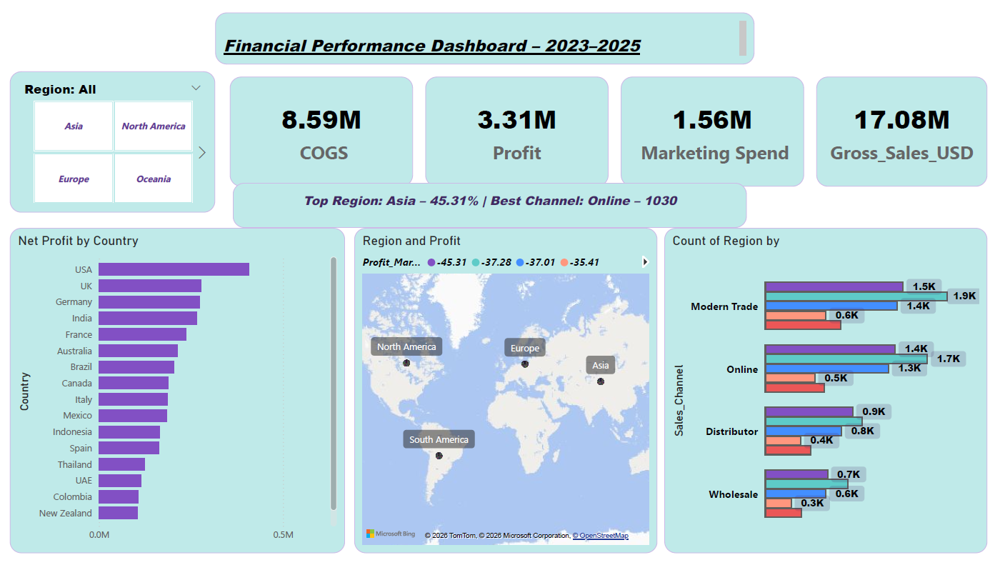

# 📉 Corporate Financial Performance & Profitability Analysis (2023-2025)

مشروع تحليل مالي متقدم يهدف إلى تقييم الكفاءة التشغيلية والربحية للمؤسسة من خلال تتبع الإيرادات، التكاليف، والمصاريف التسويقية عبر مختلف دول وأقاليم العالم وقنوات التوزيع.

## 🎯 الواجهة المالية التفاعلية

## 📌 المؤشرات المالية الرئيسية (Key Financial KPIs)
* **إجمالي المبيعات (Gross Sales USD):** حققت المؤسسة 17.08M دولار.
* **تكلفة البضاعة المباعة (COGS):** بلغت 8.59M دولار.
* **صافي الأرباح المحققة (Net Profit):** وصل إلى 3.31M دولار.
* **المصاريف التسويقية (Marketing Spend):** بلغت 1.56M دولار.

## 📈 التحليلات المالية المستنتجة (Financial Insights)
* **كفاءة الأقاليم وقنوات البيع:** قادت **قارة آسيا** الأداء المالي بنسبة ربحية بلغت **45.31%**، بينما كانت القناة **الرقمية عبر الإنترنت (Online)** هي أفضل قنوات التوزيع كفاءة.
* **توزيع قنوات البيع الجغرافية:** يظهر توازن ملحوظ في قنوات البيع مثل (Modern Trade, Online, Distributor, Wholesale) عبر المناطق المختلفة، مع تفوق واضح للقنوات الرقمية والمودرن تريد في حجم العمليات.

## 🛠️ العمليات التقنية المتقدمة (Power Query & DAX)
تم بناء هذا المشروع وتجهيزه عبر العمليات التقنية التالية لضمان دقة الأرقام:

### 1️⃣ تنظيف وتشكيل البيانات (Power Query):
* معالجة وتحويل قيم العملات إلى تنسيق موحد (USD) لتفادي فروقات الصرف الجغرافية.
* إزالة القيم المفقودة (Null values) في خانات التكاليف والرواتب لضمان دقة المجاميع.
* دمج جداول المبيعات مع جداول قنوات التوزيع عبر تقنية (Merge Queries) لربط القنوات بالأقاليم.

### 2️⃣ العمليات الحسابية المتقدمة (DAX Measures):
تم استخدام لغة DAX لبناء المقاييس الحسابية التالية:
* **حساب صافي الأرباح:**
  `Net Profit = [Gross Sales] - [COGS] - [Marketing Spend]`
* **حساب النسبة المئوية للمساهمة الإقليمية:**
  `Region Profit Margin % = DIVIDE([Region Profit], [Total Profit], 0)`

---
**تمت الدراسة والتصميم المالي بواسطة:** Abqar
